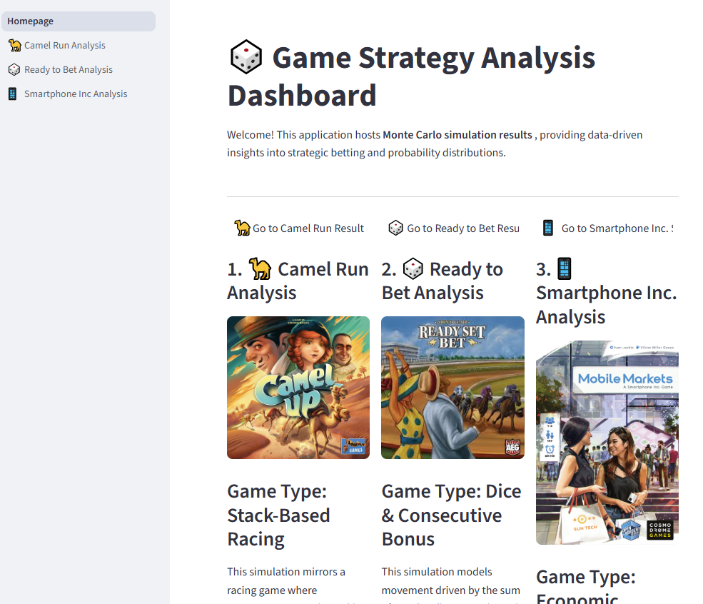

🚀 Board Game Study Simulation

## 📋 Prerequisites

* **Git:** For cloning the repository.
* **Python (3.7+ recommended):** For running the application.
* **CMD/PowerShell:** For starting application locally.
---

## 1. ⬇️ Git Clone the Repository

Open 

```bash
git clone https://github.com/philiplamscript/BG-study.git
cd BG-study
```

## 2. ⚙️ Install Requirements
(Optional but Recommended) Create and Activate Virtual Environment

On macOS/Linux:
```bash
python3 -m venv venv
source venv/bin/activate
```

On Windows (Command Prompt):
```bash
python -m venv venv
venv\Scripts\activate
```

Install Dependencies
```bash
pip install -r requirements.txt
```

## 3. ▶️ Run Streamlit Application
```bash
streamlit run Homepage.py
```

Finally you show see the page as below, Take you interested topic, then Navigate to trail the simulation.



### ENJOY!


