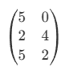
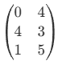
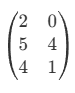
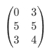

# Smartphone Inc. Combination Analysis

This Jupyter notebook, `Smartphone Inc.ipynb`, performs an exhaustive analysis of planing phrase Planning Pads combinations for the "Mobile Markets, Smartphone Inc." board game, calculating various resulting metrics for each valid placement scenario.

The core goal is to identify unique and "optimal" combinations based on the resulting **price**, **base production**, **technology (tech)**, and **promotion (promot)** values.

## 💾 Core Data Structures and Definitions

The analysis revolves around the placement of two pieces (or Planning Pads), designated **W** (White) and **B** (Black).

### 🧩 **Piece Types (Labels) and Item Values**

The numbers (labels) within the piece matrices correspond to different item types found on the **Smartphone Inc. Office Board**. These values are used internally by the `record_box` function to calculate the total yield for Production, Technology, and Promotion tiers.

| Label in Matrix | Spec image| Item Type  | Effect
| :---: | :--- | :--- | :--- |
| **0** | NA |`empty_label`  | No Effect
| **1** | |Production Items  | **Production** +1
| **2** | |Cheap Production Items | **Production** +1 & **Price** -1
| **3** | |Expensive Items |**Price**+1
| **4** | |Technology (Tech) Items |**Technology**+1
| **5** | |Promotion (Promot) Items  |**Promotion**+1

### **Initial Piece Configurations:**

Two shapes (Call Pod W and Pod B) are defined for each player, labeled side 0 and 1:

| Variable name |Pod| Matrix Configuration |
| :--- | :--- | :--- |
| **`box_W[0]`** | | |
| **`box_W[1]`** | | |
| **`box_B[0]`** | | |
| **`box_B[1]`** | | |

<!-- ## 🛠️ Key Functions and Logic

### **1. `rot90_t(arr, n)`**
* **Purpose:** Rotates a NumPy array (representing a board piece) $90^\circ$ clockwise, $n$ times.

### **2. `place_box(box, place, i, j, show_plt=False)`**
* **Purpose:** Places a board piece (`box`) onto the main board (`place`) at coordinates $(i, j)$.
* **Key Logic:**
    * It calculates `is_replace_box` (a mask) to track covered cells:
        * **1:** Exposed (cell only in the `place` board or only in the `box` being placed)
        * **2:** Replaced/Covered (cell present in both the `place` board and the `box` being placed)
    * It creates `combina_box` (the resulting board) by placing the new piece's items (`box`) on top of the existing items (`place`). **This simulates the stacking/covering mechanism of the game.**

### **3. `record_box(replace_box, Combina_box, n)`**
* **Purpose:** Calculates the game-relevant metrics for a given board combination.
* **Calculated Metrics:**
    * `'replaced'` and `'exposed'`: Counts from the `is_replace_box` mask.
    * Individual item counts: `'production items'`, `'cheap production'`, `'price items'`, `'tech'`, `'promot'`.
    * `'appear items'`: Total number of visible items on the board.
    * **`'base production'`**: Calculated as `production items` + `cheap production` + `replaced`.
    * **`'price'`**: Calculated as $5 + \text{price items} - \text{cheap production}$. -->

### **Combination Generation Loop**
This section generates all possible combinations and records their metrics.

* It iterates through all combinations of:

    * `W_filp` (Box W 0 or 1)
    * `B_filp` (Box B 0 or 1)
    * `trans_times` (Box B rotation: 0, 90, 180, 270 degrees)
    * `i` and `j` (Box B placement coordinates)
* Box W is fixed at a centered position $\left((i, j) = (2, 2)\right)$.
* **Two covering scenarios are considered for each placement:**
    1.  Box B is placed **after** Box W (Box B is `major_b='b'`)
    2.  Box W is placed **after** Box B (Box W is `major_b='w'`)
* **Invalid combinations are filtered out** if the number of covered cells (`replaced`) is 0 or 5.
* Total 420 combination results are stored in `result_df` and the board images are stored in `Combina_box_record`.

## 📈 Analysis and Results

### **Summary of Metrics by Price**
The notebook groups all valid combinations by the calculated `price` and reports the descriptive statistics (`max`, `min`) for the key output variables: `base production`, `tech`, and `promot`.

|Price |No. of Combination|Base production (Max) |Base production (Min) |Tech (Max)|Tech (Min)|Promot (Max)|Promot (Min)
|---|---|---|---|---|---|---|---
|2|52|7|4|3|1|3|2
|3|47|6|4|3|2|3|1
|4|65|7|3|4|1|4|1
|5|98|6|3|4|1|4|1
|6|49|6|2|4|1|4|1
|7|61|5|2|3|1|4|1
|8|48|4|1|3|1|3|1

### **Optimal Combination Identification**
A combination is defined as **"optimal"** if, for its resulting `price`, no other combination exists that has **greater** values for **`base production`**, **`tech`**, and **`promot`**.

* Do not pay much to worry that the combination you did are not optimal, since identified **409 out of 420 combinations (97%) that meet this optimal criterion**.
* Those 11 non-optimal combinations spec:

|id|Price|Base Production|Tech|Promot|Increasement
|---|---|---|---|---|---
|109|6|4|2|2|+1 in Tech
|120|4|6|1|2|+1 in Tech
|122|4|5|2|2|+1 in Tech or +1 in Base Production
|142|4|5|2|2|+1 in Tech or +1 in Base Production
|144|4|6|1|2|+1 in Tech
|150|4|5|2|2|+1 in Tech or +1 in Base Production
|170|4|6|1|2|+1 in Tech
|172|4|6|1|2|+1 in Tech
|192|4|5|2|2|+1 in Tech or +1 in Base Production
|194|4|5|2|2|+1 in Tech or +1 in Base Production
|202|4|6|1|2|+1 in Tech

* Those 409 optimal placement combinations are turned into **58 optimal spec combinations**.

* Lists 11 **unique and optimal spec** that are not easy to combina.

|id|Price|Base Production|Tech|Promot
|---|---|---|---|---
|408|8|4|2|1
|358|8|3|3|1
|375|8|3|1|3
|149|7|3|1|4
|278|6|6|2|1
|169|6|5|1|2
|296|6|4|3|2
|277|4|7|2|1
|261|4|4|4|2
|57|3|6|3|1
|94|2|6|1|3

